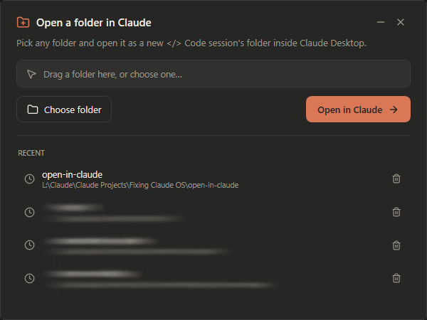

# Open in Claude

Claude Desktop's Code tab pins to one working folder with no built-in way to switch. **Open in Claude** fixes that — pick any folder and open it as a new Code session in one click.

  

---

<p align="center">
  
</p>

---

## How it works

The Claude Desktop app registers a `claude://` URL protocol with a built-in route for opening a new Code session in a chosen folder:

```
claude://code/new?folder=<path>
```

Open in Claude wraps that deep link in a minimal dark UI — pick a folder, hit **Open in Claude**, done. Works whether the app is already running or closed.

### How sessions are saved

Open in Claude points a new, unsaved session at your folder. The folder only sticks once you send your first prompt — that commits the session. Before that it's provisional: clicking an existing session first reverts the app to its previously pinned folder, and you'll need to open your folder again.

After the session is saved, set the sidebar to sort by project. A `+` appears next to the project name, letting you launch further sessions in that folder straight from the sidebar.

---

## Getting started

### Option A — Double-click exe (simplest)

Download `OpenInClaude.exe` from the [latest release](../../releases/latest) and run it. No install, no admin.

### Option B — Run from source

Requires Windows PowerShell 5.1 (built into Windows 10/11).

```powershell
powershell -ExecutionPolicy Bypass -File "Open in Claude.cmd"
```

Or double-click **`Open in Claude.cmd`** in Explorer.

### Option C — Build the exe yourself

```powershell
powershell -ExecutionPolicy Bypass -File build.ps1
```

Installs [`ps2exe`](https://github.com/MScholtes/PS2EXE) (current user, no admin) and produces `OpenInClaude.exe`.

---

## Is this safe? ("Windows protected your PC")

Yes. When you run `OpenInClaude.exe`, Windows SmartScreen may show a blue **"Windows protected your PC"** warning. This happens to every unsigned app from an independent developer — code-signing certificates cost a few hundred dollars a year, which isn't worth it for a free 70 KB utility.

To run it: click **More info**, then **Run anyway**.

If you'd rather not trust the prebuilt binary, you don't have to:

- **Read the source** — it's two PowerShell files: a small build script and one main script (no compiled magic). No network calls, no telemetry. It writes one file: your recent-folders list at `%APPDATA%\OpenInClaude\recents.json`.
- **Run from source instead** (Option B above) — no `.exe` involved.
- **Build the `.exe` yourself** (Option C) — compile the exact same code locally.

The only thing this app does is wrap the `claude://code/new?folder=<path>` deep link that Claude Desktop already registers.

---

## Usage

| Action | Result |
|--------|--------|
| **Choose folder…** | Opens the native Windows folder picker |
| **Drag a folder** onto the window | Populates the path field |
| **Click a Recent entry** | Selects it |
| **Double-click a Recent entry** | Opens it immediately |
| **Open in Claude** button | Fires the deep link, session opens |
| **Esc** | Closes the app |

Recent folders are persisted between runs at `%APPDATA%\OpenInClaude\recents.json`.

The first time you open a folder, Claude shows a one-time **"Trust this Workspace?"** prompt — approve it and you won't see it again for that folder.

---

## Requirements

- Windows 10 or 11
- [Claude Desktop](https://claude.ai/download) installed (registers the `claude://` protocol)

---

## Known limitation

Opening an **old session** in the Desktop app restores that session's original folder, overwriting the selected one. This is a server-side limitation — the working folder is stored per-session on Anthropic's side and there is no local override. Open in Claude only controls *new* sessions.
